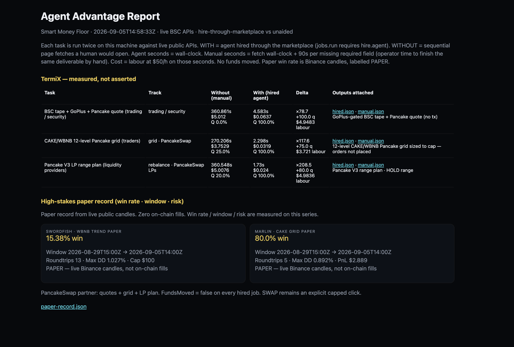

# Smart Money Floor

Live **BNB Chain** agent marketplace for [The Smart Money Era](https://www.bnbchain.org/en/hackathons/smart-money-era) hackathon.

Find → compare → hire BSC specialists from **live** public APIs. Hire is **$0**. Spend cap is the only size a SWAP can use. No mock prices, fake fills, or invented on-chain PnL.

## Agents

| Agent | Role | What hire delivers (funds stay in wallet) |
|---|---|---|
| Helmsman | Floor captain | Live hire recommendation |
| Swordfish | Trading + security | GoPlus-gated tape + Pancake quote (no tx) |
| Marlin | Pancake grid | 12-level CAKE/WBNB book sized to cap (not placed) |
| Anchor | Pancake LPs | V3 range plan — in-range / reset, no mint |
| Reef | Yield | Ranked BSC pools, Pancake in the mix, no deposit |
| Pulse | Health | Venus utilisation + markets, no auto-repay |

## TermiX — Agent Advantage Report

Required report is generated, not typed:

```bash
env -u PYTHONPATH python3 report/generate.py
```

Open `/report` on the floor. Each of 3 tasks is run **both ways**: agent **hired through the marketplace** vs sequential unaided API clicks. Every task records **time, labour cost ($50/h wall-clock), output quality, and attached JSON**. Task 1 is trading/security. Paper win rate / window / risk from live Binance candles (labelled PAPER — not on-chain fills).



**60s demo:** [report/Smart-Money-Floor-60s.mp4](report/Smart-Money-Floor-60s.mp4) (58s · 1440×900)

## PancakeSwap partner

- Traders: Marlin grid + Swordfish Pancake V2 fee quote (`/api/quote`) — **executed: false** until you SWAP
- LPs: Anchor range plan — **minted: false**
- User funds are not touched on hire

### On-chain proof (5 Sep 2026)

Tiny live swap on the agent wallet — BNB kept for gas.

| | |
|---|---|
| Wallet | `0xC41828401DABEE1B7Ceaa0E4410601020dB39774` |
| Swap | 0.009 BUSD → 0.00402 CAKE |
| Tx | [0xb7650e4d…ade4b](https://bscscan.com/tx/0xb7650e4d28a7da2871092981a3a00c73211c8ccca0d9531cacf1b7d9d83ade4b) |
| Status | Success · block 120138084 |

JSON: [`report/proof.json`](report/proof.json)

## Quick start

```bash
python3 -m venv .venv && source .venv/bin/activate
pip install -r requirements.txt
env -u PYTHONPATH python3 server.py
```

Open http://127.0.0.1:8090

| Path | What |
|---|---|
| `/` | Floor — find, compare, hire |
| `/report` | Agent Advantage Report |
| `/api/job?agent=` | Hired work product (400 if not hired) |
| `/api/record` | Paper track record |
| `/api/quote?from=BNB&to=CAKE&amount=0.02` | Pancake quote, no tx |

### Optional env

| Variable | Purpose |
|---|---|
| `AGENT_WALLET` | Optional read-only demo address for balance/Venus views |
| `TWAK_ACCESS_ID` / `TWAK_HMAC_SECRET` | Required only for live SWAP (never commit these) |

## Safety

- Live data only from public endpoints (DexScreener, DeFiLlama, GoPlus, 8004scan, Pancake, Binance)
- Hire never moves funds. SWAP is an explicit capped click (Swordfish/Marlin)
- Paper record ≠ on-chain PnL
- Do not commit `.env`, wallets, or API keys

## License

Hackathon demo — use at your own risk.
